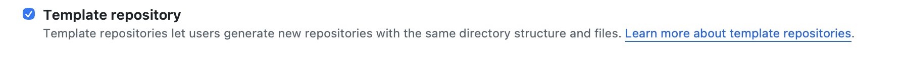
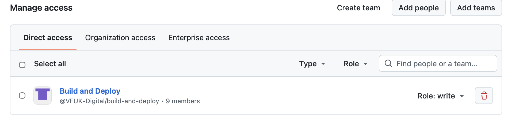
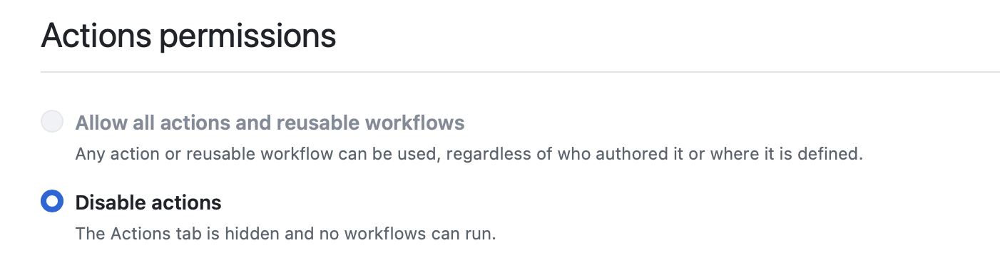

# dal-demo-lambda

Demo Lambda created by the platform command

This repository was generated from the Vodafone Java Lambda template.

## Service configuration

- Owner: `platform-team`
- Division: `Technology`
- Lifecycle: `experimental`
- Release train: `common`
- Package: `com.vf.uk.dal.demo`

## Local development

Run the unit tests with Maven:

```bash
mvn test
```

The IntelliJ run configurations under `.run/` use the generated service and class names.

## Template Repository Configuration

### 1. Settings -> General

Check the `Template Repository` check box.



### 2. Access -> `Collaborators and teams`



Click on `Add teams`.

Locate `Build and Deploy`.

Select `write`.

Click `Save`.

### 3. Actions -> `General`



Click `Disable actions`.

Click the `Save` button.
